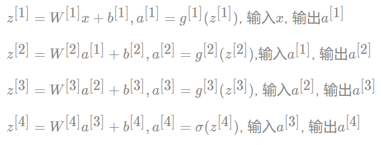
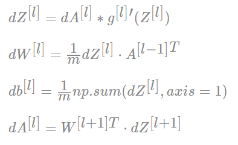

# 1.正反向传播

**前向传播**：从input，经过一层层的layer，不断计算每一层的z和a，最后得到输出y^的过程，计算出了y^，就可以根据它和真实值y的差别来计算损失（loss）。

**反向传播**：根据损失函数L(y^,y)来反方向地计算每一层的z、a、w、b的偏导数（梯度），从而更新参数。

每经过一次前向传播和反向传播之后，参数就更新一次，然后用新的参数再次循环上面的过程。这就是神经网络训练的整个过程。


## 1.1浅层神经网络

### 1.1.1**前向传播**

假设我们有如下结构的网络

我们对第一个隐藏层记为[1]，输出层为[2]。


计算图如下：


**单个样本的向量化表示**

现在把上面的第一层计算过程用向量化的形式表示出来


对于上述例子，将所有层通过向量把整个前向过程表示出来，并且确定每一个组成部分的形状


**如果有多个样本如何考虑？**

当样本数变多，假设含有m个样本，相当于x由原来的x[3,1]变为了x[3,m]。那么上述过程变为：


### 1.1.2**激活函数的选择**

为什么要使用激活函数？

```
因为神经网络中每一层的输入输出都是一个线性求和的过程，下一层的输出只是承接了上一层输入函数的线性变换，所以如果没有激活函数，那么无论你构造的神经网络多么复杂，有多少层，最后的输出都是输入的线性组合，纯粹的线性组合并不能够解决更为复杂的问题。而引入激活函数之后，我们会发现常见的激活函数都是非线性的，因此也会给神经元引入非线性元素，使得神经网络可以逼近其他的任何非线性函数，这样可以使得神经网络应用到更多非线性模型中。涉及到网络的优化时候，会有不同的激活函数选择。
```

可供选择的激活函数有：

**sigmoid函数：**

sigmoid函数也叫Logistic函数，用于隐层神经元输出，取值范围为(0,1)，它可以将一个实数映射到(0,1)的区间，可以用来做二分类。在特征相差比较复杂或是相差不是特别大时效果比较好。sigmoid是一个十分常见的激活函数，函数的表达式及图形如下：


**在什么情况下适合使用 Sigmoid 激活函数呢？**

```
Sigmoid 函数的输出范围是 0 到 1，因此它对每个神经元的输出进行了归一化。因此 Sigmoid 函数非常合适用于将预测概率作为输出的模型
```

**Sigmoid 激活函数存在的不足：**

```
梯度消失：Sigmoid 函数趋近 0 和 1 的时候变化率会变得平坦，梯度趋近于 0。

神经网络使用 Sigmoid 激活函数进行反向传播时，输出接近 0 或 1 的神经元其梯度趋近于 0。这些神经元叫作饱和神经元。因此，这些神经元的权重不会更新。此外，与此类神经元相连的神经元的权重也更新得很慢。该问题叫作梯度消失。因此，想象一下，如果一个大型神经网络包含 Sigmoid 神经元，而其中很多个都处于饱和状态，那么该网络无法执行反向传播。

不以零为中心：Sigmoid 输出不以零为中心的,，输出恒大于0，非零中心化的输出会使得其后一层的神经元的输入发生偏置偏移（Bias Shift），并进一步使得梯度下降的收敛速度变慢。

计算成本高昂：exp() 函数与其他非线性激活函数相比，计算成本高昂，计算机运行起来速度较慢。
```


**tanh 函数：**函数表达式及图像如下：


​                           

tanh 函数和 sigmoid 函数的曲线相对相似。二者的区别在于输出间隔，tanh 的输出间隔为 1，并且整个函数以 0 为中心，比 sigmoid 函数更好。

**tanh存在的不足：**

```
与sigmoid类似，Tanh 函数也会有梯度消失的问题，因此在饱和时（x很大或很小时）也会「杀死」梯度。

注意：在一般的二元分类问题中，tanh 函数用于隐藏层，而 sigmoid 函数用于输出层，但这并不是固定的，需要根据特定问题进行调整。
```


**ReLU 函数**

ReLU函数弥补了sigmoid函数以及tanh函数的梯度消失问题，在目前的深度神经网络中被广泛使用。ReLU函数本质上是一个斜坡（ramp）函数，公式及函数图像如下：

 


相比于 sigmoid 函数和 tanh 函数

**它具有如下优点：**

```
当输入为正时，导数为1，一定程度上改善了梯度消失问题，加速梯度下降的收敛速度；

计算速度快得多。ReLU 函数中只存在线性关系，因此它的计算速度比 sigmoid 和 tanh 更快。
```

**ReLU函数的不足：**

```
Dead ReLU 问题。当输入为负时，ReLU 完全失效，在正向传播过程中，这不是问题。有些区域很敏感，有些则不敏感。但是在反向传播过程中，如果输入负数，则梯度将完全为零；

不以零为中心：和 Sigmoid 激活函数类似，ReLU 函数的输出不以零为中心，ReLU 函数的输出为 0 或正数,给后一层的神经网络引入偏置偏移，会影响梯度下降的效率。
```


**Leaky ReLU函数**

为了解决 ReLU 激活函数中的梯度消失问题，当 x < 0 时，我们使用 Leaky ReLU——该函数试图修复 dead ReLU 问题。

 


**为什么使用Leaky ReLU会比ReLU效果要好呢？**

```
Leaky ReLU 通过把 x 的非常小的线性分量给予负输入（0.01x）来调整负值的零梯度问题，当 x < 0 时，它得到 0.1 的正梯度。该函数一定程度上缓解了 dead ReLU 问题，

leak 有助于扩大 ReLU 函数的范围，通常 a 的值为 0.01 左右；

Leaky ReLU 的函数范围是（负无穷到正无穷）

尽管Leaky ReLU具备 ReLU 激活函数的所有特征（如计算高效、快速收敛、在正区域内不会饱和），但并不能完全证明在实际操作中Leaky ReLU 总是比 ReLU 更好。
```


### 1.1.3**反向传播**

在反向传播过程中，求导是一个十分重要的过程，具体的链式法则的介绍以及反向传播推导过程请参考上课讲解

假设上述网络的隐层激活函数改为tanh，最后一层为sigmoid函数


最后一个输出层的参数导数：


隐藏层的导数计算：


## 1.2深层神经网络

**为什么使用深层网络**？

```
那其实大家发现使用浅层网络的时候很多分类等问题得不到很好的解决，所以需要深层的网络。例如对于人脸识别等应用，神经网络的第一层从原始图片中提取人脸的轮廓和边缘，每个神经元学习到不同边缘的信息；网络的第二层将第一层学得的边缘信息组合起来，形成人脸的一些局部的特征，例如眼睛、嘴巴等；后面的几层逐步将上一层的特征组合起来，形成人脸的模样。随着神经网络层数的增加，特征也从原来的边缘逐步扩展为人脸的整体，由整体到局部，由简单到复杂。层数越多，那么模型学习的效果也就越精确。随着神经网络的深度加深，模型能够学习到更加复杂的问题，功能也更加强大。
```

**深层神经网络表示**

这里我们以四层网络的前向传播与反向传播为例

首先对每层的符号进行一个确定，我们设置L为第几层，n为每一层的个数，L=[L1,L2,L3,L4],n=[5,5,3,1]


### 1.2.1前向传播

首先还是以单个样本来进行表示，每层经过线性计算和激活函数计算



我们将上式用通用公式表达出来

首先x=a[0]


当我们含有m个样本时


### 1.2.2反向传播

因为设计到的层数较多，我们通过一个图来表示反向的过程


单个样本的反向传播：


多个样本的反向传播：



# 2.参数初始化

```python
参数**：我们在过程中想要模型学习到的信息（模型自己能计算出来的），例如 W[l]W[l]，b[l]b[l]。

**超参数**:即为控制参数的输出值的一些网络信息（需要人经验判断）。超参数的改变会导致最终得到的参数 W[l]，b[l] 的改变。

典型的超参数有：学习速率：α、迭代次数：N、隐藏层的层数：L、每一层的神经元个数：n[1]，n[2]，...、激活函数 g(z) 的选择

**参数初始化：**深度学习的初始化参数指的是在网络训练之前，对各个节点的权重和偏置进行初始化的过程，很多时候我们以为这个初始化是无关紧要的，不需要什么讲究，但是实际上，一个参数的初始化关系到网络能否训练出好的结果或者是以多快的速度收敛，这都是至关重要的，有时候因为参数初始化的缘故，甚至得不到好的训练结果。
```

**假设全部初始化为零可以吗？**


以该图为例，如果全部初始化为零的话，每层layer的不同神经元相当于在计算相同的函数，在进行反向传播计算的时候同层layer的不同神经元计算得到的dz也是相同的。但我们想要两个不同的隐藏单元来计算不同的函数

如何解决该问题？

**随机初始化参数**

还是以2个输入，2个隐藏神经元为例：


这里的W乘以0.01，因为通常我们更倾向于将权重初始化为非常小的随机值

如果W过大的话，Z=W*X+b也会变大，当你的激活函数选用了tan函数或者sigmoid函数的话，意味着梯度下降将会十分缓慢，所以学习效率也会非常缓慢

当然这里乘以0.01是一个合理的尝试，可以根据隐藏层的大小来调节


# 3.正则化

## 3.1偏差与方差

### 3.1.1数据集划分


训练集：用训练集对算法或模型进行训练过程；用来调试神经网络

验证集：用来查看训练效果

测试集：用来测试网络的实际学习能力，对学习方法进行评估。

**验证集和测试集的区别**

```
验证集:使用验证集是为了**快速调参**，也就是用验证集选择超参数。另外用验证集还可以监控模型是否异常（过拟合啦什么的），然后决定是不是要提前停止训练。

验证集的关键在于选择超参数，我们手动调参是为了让模型在验证集上的表现越来越好，如果把测试集作为验证集，调参去拟合测试集，就有点像作弊了。

测试集(test set): 用来评估模最终模型的泛化能力。既**不参与参数的学习过程**，**也不参与参数的选择过程**，仅仅用于模型评价。

在小数据量的时代，如 100、1000、10000 的数据量大小，可以将数据集按照以下比例进行划分：

无验证集的情况：70%训练集/ 30%测试集

有验证集的情况：60%训练集 / 20%验证集 / 20%测试集

而在如今的大数据时代，拥有的数据集的规模可能是百万级别的，所以验证集和测试集所占的比重会趋向于变得更小。

100 万数据量：98% / 1% / 1%

超百万数据量：99.5% / 0.25% / 0.25%

以上这些比例可以根据数据集情况选择
```

### 3.1.2偏差与方差的意义

```
偏差：度量了学习算法的期望预测与真实结果的偏离程度，即刻画了学习算法本身的拟合能力

方差：度量了同样大小的训练集的变动所导致的学习性能的变化，即刻画了数据扰动所造成的影响

偏差、方差与我们的数据集划分到底有什么关系呢？

1、训练集的错误率较小，而验证集/测试集的错误率较大，说明模型存在较大方差，可能出现了过拟合

2、训练集和测试集的错误率都较大，且两者相近，说明模型存在较大偏差，可能出现了欠拟合

3、训练集和测试集的错误率都较小，且两者相近，说明方差和偏差都较小，这个模型效果比较好。
```

举个栗子


```
如左图所示：如果给这个数据集拟合一条直线，可能得到一个逻辑回归拟合，但他并不能很好的拟合该数据集。这就是偏差高的情况。我们称之为欠拟合。

如右图所示：如果我们拟合了一个非常复杂的分类器，比如深度神经网络或含有隐藏单元的神经网络，就可能非常适用于这个数据集，但这看起来也不是一种很好的拟合方式。分类器方差较高，数据过度拟合

如中间图所示：在两者之间，可能还有一些像图中这样的复杂程度适中，数据拟合适度的分类器，这个看起来更合理，我们称之为适度拟合，是介于过拟合和欠拟合中间的一类
```

### 3.1.3高偏差、高方差的解决办法？

```
对于**高偏差**，有以下几种方式：
1、扩大网络规模，如添加隐藏层或者神经元数量
2、寻找合适的网络架构，使用更大的网络结构，如AlexNet，训练时间更长一些

对于**高方差**，有以下几种方式：
1、获取更多的数据，使得训练能够包含所有可能出现的情况
2、正则化（Regularization）
```

## 3.2正则化

### 3.2.1L1、L2正则化

正则化：即在成本函数中加入一个正则化项(惩罚项)，惩罚模型的复杂度，防止网络过拟合

L1正则化的损失函数为：


上式可知，当w大于0时，更新的参数w变小；当w小于0时，更新的参数w变大；所以，L1正则化容易使参数变为0，即特征稀疏化。

L2正则化的损失函数为：


由上式可知，正则化的更新参数相比于未含正则项的更新参数多了


项，当w趋向于0时，参数减小的非常缓慢，因此L2正则化使参数减小到很小的范围，但不为0。

### 3.2.2神经网络中的正则化

神经网络中的正则化与逻辑回归相似，只不过参数W变多了，每一层都有若干个权重，可以理解成一个矩阵


我们把w[l]理解某一层神经元的权重参数，其中这是加入了L2范数


**正则化为什么能够防止过拟合？**

正则化因子设置的足够大的情况下，为了使成本函数最小化，权重矩阵W就会被设置为接近于0的值，直观上相当于消除了很多神经元的影响，那么大的神经网络就会变成一个较小的网络


在加入正则化项后，当λ增大，导致W[l]减小，Z[l]=W[l]a[l-1]+b[l]便会减小，由上图可知，在z较小（接近于0）的区域里，函数近似线性，所以每层的函数就近似线性函数，整个网络就成为一个简单的近似线性的网络，因此不会发生过拟合

### 3.2.3Dropout正则化

Droupout：随机的对神经网络每一层进行丢弃部分神经元操作。


对于网络的每一层会进行设置保留概率，即keep_prob。假设keep_prob为0.8，那么也就是在每一层所有神经元有20% 的概率直接失效，可以理解为0.

**如何实现dropout正则化呢？**

**Inverted dropout（反向随机激活）**


**dropout为什么有效？**

通过dropout 该单元的输入几乎被消除

所以得到的值不能依靠任何特征，因为这些特征都可能在dropout过程中被舍弃

我不愿意把所有赌注都放在一个节点上，不愿意给任何一个输入加上太多权重

因此该单元将通过这种方式积极的传播开，通过传播所有权重，dropout将产生收缩权重的平方范数的效果

当然dropout也存在成本函数无法被定义的缺点，因为成本函数需要求哪些W是数都不知道，导致了参数无法确定哪一些带来计算的麻烦。所以一般，我们需要首先保证网络损失函数是一个梯度下降过程，然后再开启droput，来看一下能不能防止过拟合

### 3.2.4其它正则化方法

#### 3.2.4.1早停止法（Early Stopping）

早停止法：通常不断训练之后，损失越来越小。但是到了一定程度之后，模型学到的过于复杂（过于拟合训练集上的数据的特征）造成测试集开始损失较小，后来又变大。模型的w参数会越来越大，那么可以在测试集损失减小一定程度之后停止训练。


如图所示，我们可以在训练迭代到一定程度时即可停止训练

#### 3.2.4.2数据增强

数据增强：通过剪切、旋转、反射、翻转变换、缩放变换、平移变换、尺度变换、对比度变换、噪声扰动、颜色变换等一种或多种组合数据增强变换的方式来增加数据集的大小。

假设你正在拟合猫咪图片分类器，如果你想通过扩增训练数据来解决拟过拟合，但扩增数据集有时候代价比较昂贵，那我们怎么来增加数据集呢？

比如这里有只猫咪的图像：


我们可以把他翻转过来：


亦或者是把他裁剪翻转等：


通过剪切、旋转、反射、翻转变换、缩放变换、平移变换、尺度变换、对比度变换、噪声扰动、颜色变换等各种方式来增加我们的训练集。

因为训练集有冗余，这虽然不如我们额外收集一组新图片效果好，但这样做节省了获得更多猫咪图片的花费。同时也并不会给我们带来太大的损失。
