# 1.IOU

**IOU:衡量预测框和真实框的重合程度**

下图是一个示例：图中绿色框为实际框（好像不是很绿……），红色框为预测框，当我们需要判断两个框之间的关系时，主要就是判断两个框的重合程度。


**计算IOU的公式为：**

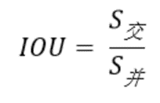

可以看到IOU是一个比值，即交并比。

在分子部分，值为预测框和实际框之间的重叠区域；

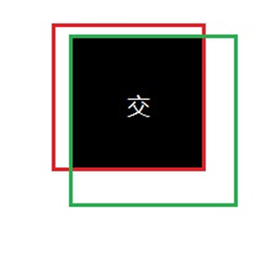

在分母部分，值为预测框和实际框所占有的总区域。

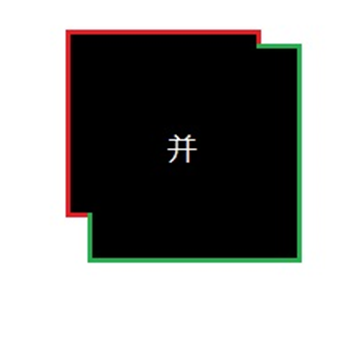

交区域和并区域的比值，就是IOU

# 2.TP TN FP FN

TP TN FP FN的概念

```
TP TN FP FN里面一共出现了4个字母，分别是T F P N。

T是True；

F是False；

P是Positive；

N是Negative。

T或者F代表的是该样本是否被正确分类。

P或者N代表的是该样本被预测成了正样本还是负样本。
```

**TP（True Positives）意思就是被分为了正样本，而且分对了。**（有预测的边界框与给定类的目标边界框的IOU>0.5）

**TN（True Negatives）意思就是被分为了负样本，而且分对了，**

**FP（False Positives）意思就是被分为了正样本，但是分错了（事实上这个样本是负样本）。**（有预测的边界框与给定类的目标边界框的IOU<0.5）

**FN（False Negatives）意思就是被分为了负样本，但是分错了（事实上这个样本是正样本）。**

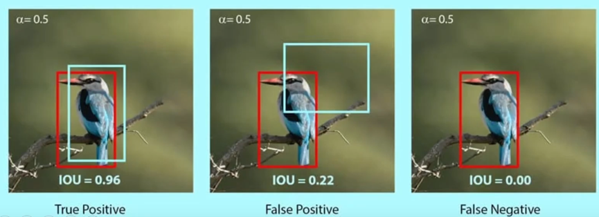


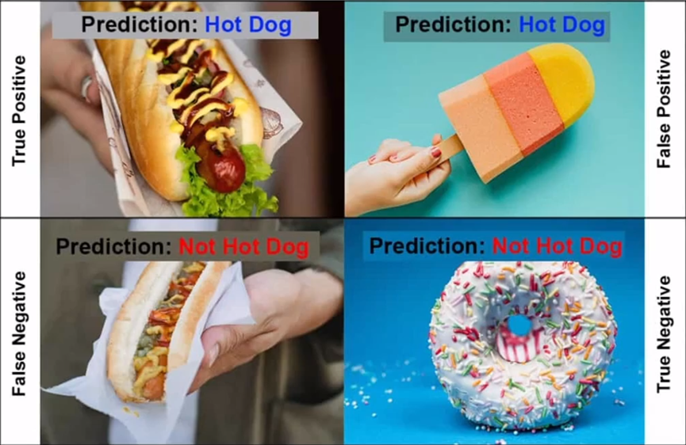


在mAP计算的过程中主要用到了TP、FP、FN这三个概念。

# 3.precision和recall

**precision（精确度）、recall（召回率）的计算公式**

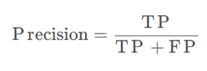

TP是分类器认为是正样本而且确实是正样本的例子，FP是分类器认为是正样本但实际上不是正样本的例子，Precision翻译成中文就是“分类器认为是正类并且确实是正类的部分占所有分类器认为是正类的比例”。

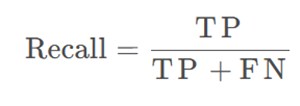

TP是分类器认为是正样本而且确实是正样本的例子，FN是分类器认为是负样本但实际上不是负样本的例子，Recall翻译成中文就是“分类器认为是正类并且确实是正类的部分占所有确实是正类的比例”。

**举个栗子**

大雁和飞机

假设现在有一个测试集，测试集中仅包含大雁和飞机两种目标，如图所示：

 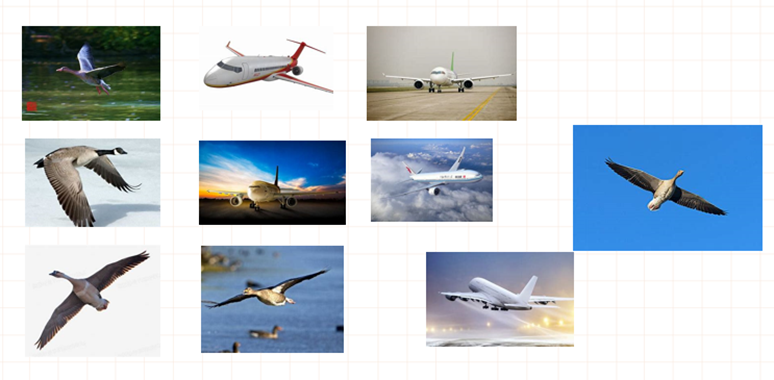

假设分类的目标是：取出测试集中所有飞机图片，而非大雁图片

现做如下定义：

True positives: 飞机的图片被正确识别为飞机

True negatives：大雁的图片被识别为大雁

False positives：大雁的图片被识别为飞机

False negatives：飞机的图片被识别为大雁

假设分类系统使用上述假设识别出结果，如下图所示：

识别为大雁的类

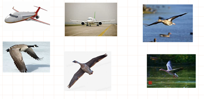

识别为大雁的图片中：

True negatives：有四个，这四个大雁的图片被识别为大雁

False negatives：有两个，这两个飞机被识别为大雁


识别为飞机的类


识别为飞机的图片中：

True positives：有三个，画绿色框的飞机

False positives：有一个，画红色框的大雁


Precision与Recall

Precision其实就是识别为飞机的图片中，True positives所占的比率：

precision = tp / (tp + fp) = tp / n

其中n表示(True positives + False positives)，也就是系统一个识别为飞机的图片数。该例子中，True positives为3，False positives为1，所以precision = 3 / (3 + 1) = 0.75，意味着识别为飞机的图片中，真正为飞机的图片占比为0.75。


Recall是被正确识别出来飞机个数与测试集中所有真正飞机个数的比值：

recall = tp / (tp + fn)

Recall的分母是(True positives + False negatives)，这两个值的和，可以理解为一共有多少张真正的飞机图片。该例子中，True positives为3，False negatives为2，那么recall的值是3 / (3 + 2) = 0.6；即所有飞机图片中，0.6的飞机被正确识别为飞机。

 

**单个指标的局限性**

在目标检测算法里面有一个非常重要的概念是置信度，如果置信度设置的高的话，预测的结果和实际情况就很符合，如果置信度低的话，就会有很多误检测。

假设一幅图里面总共有3个正样本，目标检测对这幅图的预测结果有10个，其中3个实际上是正样本，7个实际上是负样本。对应置信度如下。

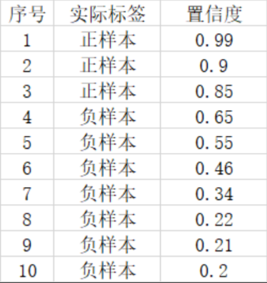

如果我们将可以接受的置信度设置为0.95的话，那么目标检测算法就会将序号为1的样本作为正样本，其它的都是负样本。此时TP = 1，FP = 0，FN = 2。

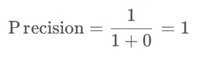

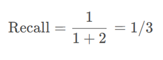

此时Precision非常高，但是事实上我们只检测出一个正样本，还有两个没有检测出来，因此只用Precision就不合适。

这个时候如果我们将可以接受的置信度设置为0.35的话，那么目标检测算法就会将序号为1的样本作为正样本，其它的都是负样本。此时TP = 3，FP = 3，FN = 0。

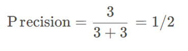

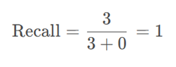

此时Recall非常高，但是事实上目标检测算法认为是正样本的样本里面，有3个样本确实是正样本，但有三个是负样本，存在非常严重的误检测，因此只用Recall就不合适。

二者进行结合才是评价的正确方法。

# 4.AP和mAP

**AP（average precision）**：衡量了模型对正样本的预测准确性。通过在不同的召回率下计算并平均精确率来得到，形成了一个曲线下的面积值，较高的AP值意味着模型具有更好的检测性能，而AP=1表示模型的检测是完美的

事实上指的是，利用不同的Precision和Recall的点的组合，画出来的曲线下面的面积。
 如下面这幅图所示。

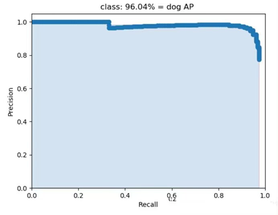

**mAP**：就是所有的类的AP值求平均。

**举个栗子**

真实标注：2个人，12只狗，1只泰迪，1辆卡车

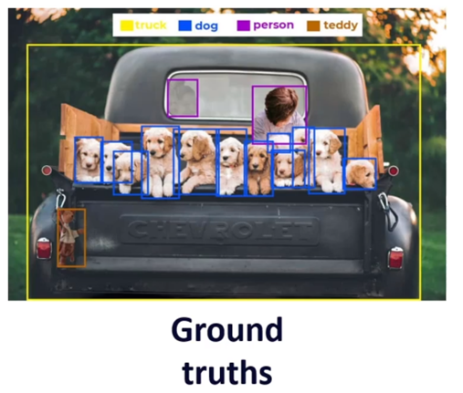


 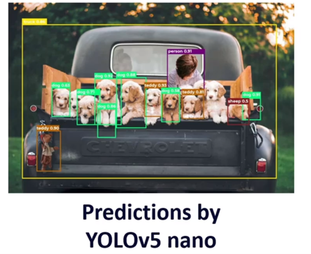


计算狗类的平均精度AP

1、 记录每一个狗的检测结构以及其对应的置信度得分

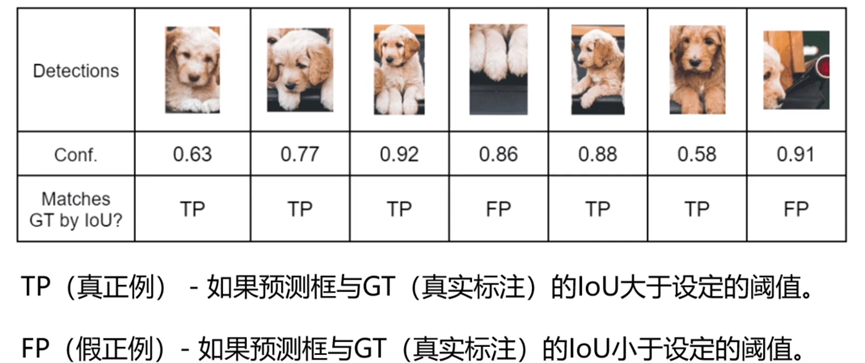

2、 根据置信度降序排列表格、列出累计的TP和FP、逐行计算精确度和召回率

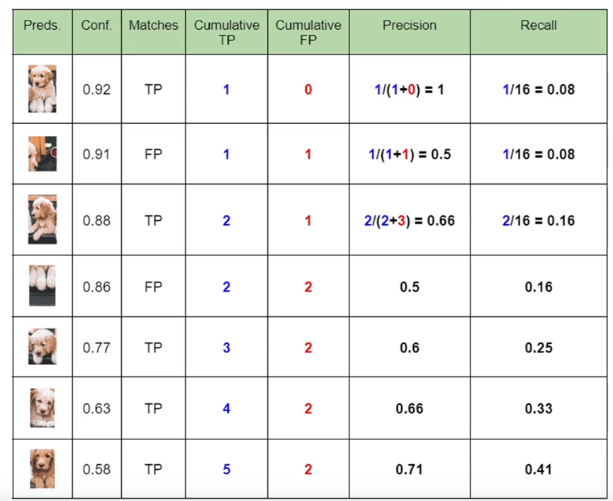

3、 绘制精确度-召回率图

如果表中对于相同的召回值有多个精确度值，可以保留最高的值，并丢弃其余的

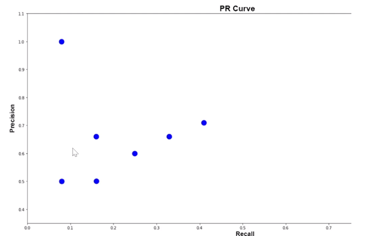

由于计算积分相对困难，因此引入插值法，计算AP公式如下：

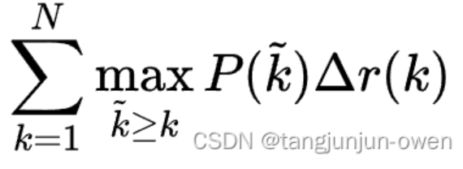

 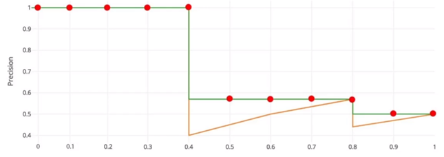


4、 绘制最终的插值图表并计算狗类的平均精度

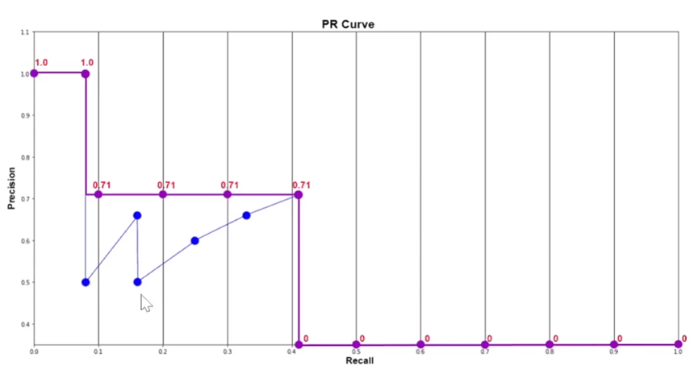

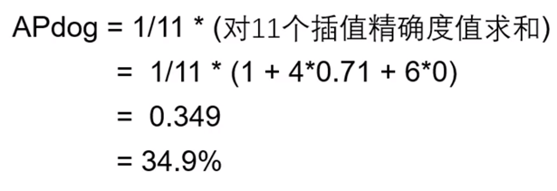


同样，我们可以计算人、泰迪熊、绵羊和卡车的平均精度（AP）。

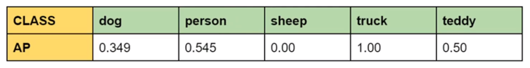

mAP：均值平均精度是所有检测到类别的平均AP值

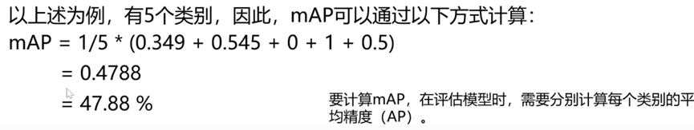

